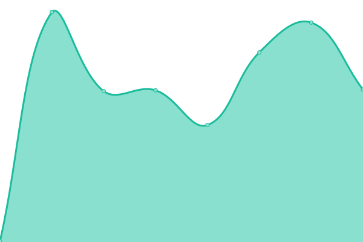

# [📈 Live Status](https://win11react.github.io/status): <!--live status--> **🟧 Partial outage**

This repository contains the open-source uptime monitor and status page for [Win11React](https://win11react.github.io/status), powered by [Upptime](https://github.com/upptime/upptime).

With [Upptime](https://upptime.js.org), you can get your own unlimited and free uptime monitor and status page, powered entirely by a GitHub repository. We use [Issues](https://github.com/win11react/status/issues) as incident reports, [Actions](https://github.com/win11react/status/actions) as uptime monitors, and [Pages](https://win11react.github.io/status) for the status page.

<!--start: status pages-->
<!-- This summary is generated by Upptime (https://github.com/upptime/upptime) -->
<!-- Do not edit this manually, your changes will be overwritten -->
<!-- prettier-ignore -->
| URL | Status | History | Response Time | Uptime |
| --- | ------ | ------- | ------------- | ------ |
|  [Win11React](http://win11.blueedge.me/) | 🟩 Up | [win11-react.yml](https://github.com/win11react/status/commits/HEAD/history/win11-react.yml) | 

 153ms
     
 | 

<a href="https://win11react.github.io/status/history/win11-react">100.00%</a>
    

|  [Docs Site](https://win11react-docs.andrewstech.me/) | 🟩 Up | [docs-site.yml](https://github.com/win11react/status/commits/HEAD/history/docs-site.yml) | 

 167ms
     
 | 

<a href="https://win11react.github.io/status/history/docs-site">100.00%</a>
    

|  [PR Preview System](https://github.com/features/actions) | 🟩 Up | [pr-preview-system.yml](https://github.com/win11react/status/commits/HEAD/history/pr-preview-system.yml) | 

 290ms
     
 | 

<a href="https://win11react.github.io/status/history/pr-preview-system">100.00%</a>
    

|  [App Store site](https://win.asylum-os.com/store/) | 🟩 Up | [app-store-site.yml](https://github.com/win11react/status/commits/HEAD/history/app-store-site.yml) | 

 169ms
     
 | 

<a href="https://win11react.github.io/status/history/app-store-site">100.00%</a>
    

|  [Blue's Website](https://blueedge.me/) | 🟩 Up | [blue-s-website.yml](https://github.com/win11react/status/commits/HEAD/history/blue-s-website.yml) | 

 140ms
     
 | 

<a href="https://win11react.github.io/status/history/blue-s-website">100.00%</a>
    

|  [Win11react.com](https://Win11react.com) | 🟥 Down | [win11react-com.yml](https://github.com/win11react/status/commits/HEAD/history/win11react-com.yml) | 

 135ms
     
 | 

<a href="https://win11react.github.io/status/history/win11react-com">97.82%</a>
    

<!--end: status pages-->

[**Visit our status website →**](https://win11react.github.io/status)

## 📄 License

- Powered by: [Upptime](https://github.com/upptime/upptime)
- Code: [MIT](./LICENSE) © [Win11React](https://win11react.github.io/status)
- Data in the `./history` directory: [Open Database License](https://opendatacommons.org/licenses/odbl/1-0/)
